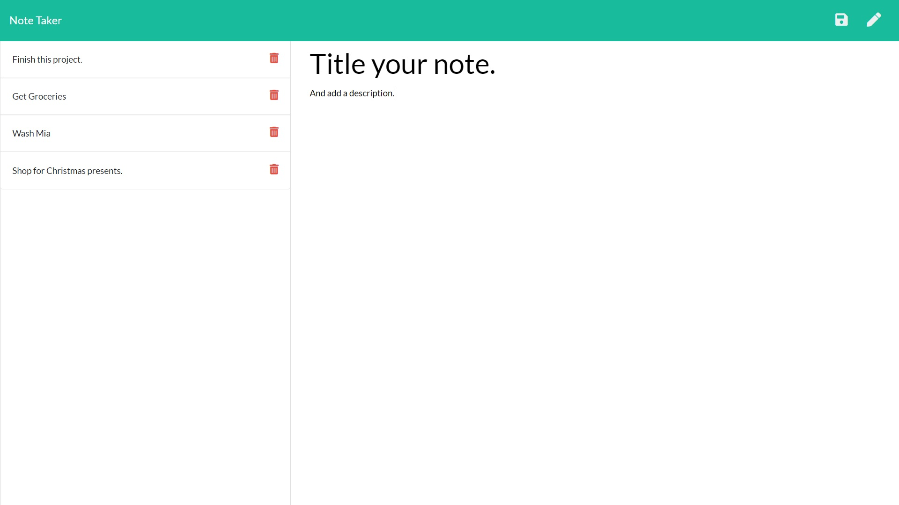

# Note-Today

    

## Deployed application

[Link to deployed application](https://arcane-mesa-14449.herokuapp.com/)

## Description

Note today is a note taking application. Add and save notes with the icons in the upper right portion of the nav. This project is built with express.js and is served using heroku. 

## Table of Contents:
* [installation](#installation)
* [usage](#usage)
* [screenshot](#screenshot)
* [credits](#credits)

## Installation 

There are no development dependencies, however testing the api with insomnia core is helpful.

## Usage 

This project is hosted on the web, navigate to the webpage url and add notes once you click through the homepage. notes are not saved per individual, but all stored on the same database. please keep content PG. 

## Screenshot

      

## Credits

UT Austin Full Stack Developer Bootcamp.

## License 

MIT
